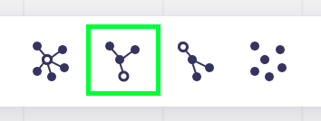

# Tracy for Miro
## About
Tracy is an plugin for Miro, that allows to hide connection lines and show them for a selection of objects in the board.
Furthermore, it allows to trace the connections of the connected objects up- and downward.
> Please use this with caution, since it might overwrite the style of all connections in a Miro board.  

## How to use the plugin
### Installing the plugin
Even if the icon already shows up in your board, you first need to install the plugin for you personal account using this link

[Authorize plugin](https://miro.com/oauth/authorize/?response_type=code&client_id=3074457367675160494&redirect_uri=%2Fconfirm-app-install%2F)

### Enabling the plugin
To enable the plugin, click the Icon in the Miro toolbar. After confirming the security prompt, the plugin is activated and can be used.
After enabling the plugin, the object menu is extended by four additional actions.

### Hiding lines
 To hide lines, select a random object in the board and click the `hide all lines` button. Depending of the number of lines, this might take a while.
 

### Trace direct connections
To trace direct connections, select one or multiple objects and click the `trace direct connections` button

### Trace connections up
To not only trace the direct connections, but the connections of the connections leading to the object(s), select the origin object(s) and click the `trace up` button. 

### Trace connections down
To do the same thing with connections from the selected object(s), click the `trace down` button

